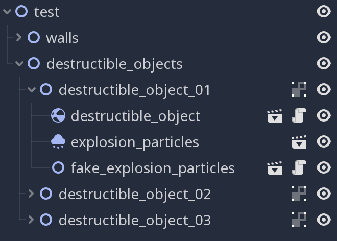

# Godot 3 2D Destructible Objects

A script that takes a sprite, divides it into blocks and makes them explode 💥!


## Limitations

Right now, the sprites must be square for this script to work properly.

## Prerequisites

Each destructible object must follow this structure and must be its own `Scene` file.

```
RigidBody2D
├── Sprite
└── CollisionShape2D
    └── RectangleShape2D
```

## Usage

* Create a `Node2D` that will contain all the destructibles objects (e.g. `destructible_objects`).
* Add a `Node2D` as a child node of the prior `Node2D` (e.g. `destructible_object_01`).
* Instance the `destructible_object` scene file.
* Attach `explode_object.gd` to the destructible object as a `Script`.



The reason for organizing it this way is because then you can add particles (`Partcicles2D` or `CPUParticles2D`), fake particles (like the ones provided with this project), hitboxes (`Area2D`) or whatever you feel like to the `Node2D` (e.g. `destructible_object_01`) holding the main `RigidBody2D` and you can then use this script to control those nodes.

Of course, you can recreate that tree in GDSscript, with something like this:

```
var node = Node2D.new()
node.name = "destructible_container"
get_parent().add_child(node, true)

var rigid_body = RigidBody2D.new()
rigid_body.name = "destructible_object"

var sprite = Sprite.new()
# Set the sprite's texture, size, etc.
sprite.texture = preload("res://path/to/texture.png")
...

var collision = CollisionShape2D.new()
collision.shape = RectangleShape2D.new()
collision.shape.extents = Vector2(..., ...)

rigid_body.add_child(sprite, true)
rigid_body.add_child(collision, true)

var script = preload("res://path/to/explode_object.gd")
rigid_body.set_script(script)

# Here you can set the 'rigid_body' variables from the script.
rigid_body.blocks_per_side = ...
rigid_body.blocks_impulse = ...

node.add_child(rigid_body, true)
```

## Parameters


### Blocks Per Side

| Name | Type | Description |
| --- | --- | --- |
| `blocks_per_side` | `int` | The blocks per side. Minium `2`. Maximum `10`. |

 **Example**: `4` block per side makes a total of `16` blocks.

### Blocks Impulse

| Name | Type | Description |
| --- | --- | --- |
| `blocks_impulse` | `float` | The "force" of the blocks when they explode. |

### Blocks Gravity Scale

| Name | Type | Description |
| --- | --- | --- |
| `blocks_gravity_scale` | `float` | The gravity of the blocks. |

### Debris max time

| Name | Type | Description |
| --- | --- | --- |
| `debris_max_time` | `float` | The seconds it will pass until the blocks become `STATIC` or, if `remove_debris` is set to `true`, they dissapear. |

### Remove debris

| Name | Type | Description |
| --- | --- | --- |
| `remove_debris` | `bool` | Controls whether the debris stays or disappears. If set to `true`, the debris will dissapear when `debris_max_time` is over. |

### Collision layers

| Name | Type | Description |
| --- | --- | --- |
| `collision_layers` | `int` | The collision layers of the blocks. |

Sum all the values of the layers.

**Example**: `Layer 1` value is `1`. `Layer 5` value is `16`. So `collision_layers` would be `17`.

### Collision masks

| Name | Type | Description |
| --- | --- | --- |
| `collision_masks` | `int` |  The collision masks of the blocks. |

Sum all the values of the layers.

**Example**: `Layer 1` value is `1`. `Layer 5` value is `16`. So `collision_layers` would be `17`.

### Explosion delay

| Name | Type | Description |
| --- | --- | --- |
| `explosion_delay` | `bool` |  Adds a delay of before setting `object.detonate` to `false`. |

Sometimes `object.detonate` is set to `false` so quickly that the explosion never happens. If this happens, try setting `explosion_delay` to `true`.

### Fake explosions group

| Name | Type | Description |
| --- | --- | --- |
| `fake_explosions_group` | `String` |  Renames the group's name of the fake explosion particles. |

This project provides an extra script for creating fake explosion particles........

### Debug mode

| Name | Type | Description |
| --- | --- | --- |
| `debug_mode` | `bool` |  Prints some debug data. |

## Changelog

See [CHANGELOG](CHANGELOG.md).

## Authors

* Me 😛 [hiulit](https://github.com/hiulit).

## Credits

Thanks to:

* Airvikar - For this [Youtube video](https://www.youtube.com/watch?v=ExX7Qyldtfg) that is the code base for this script.
* [Securas](https://twitter.com/Securas2010) - For all the [great games](https://securas.itch.io/) and [Twitch streams](https://www.twitch.tv/sec_ras/videos?filter=all&sort=time) that give me lots of ideas, and particularly, the destructible objects one.
* [Scott Lembcke](https://twitter.com/slembcke) - For letting me know about Voronoi regions (which aren't currently available) and helping me with adding more depth to the explosion (random collisions and z-index).


## License

[MIT License](LICENSE).